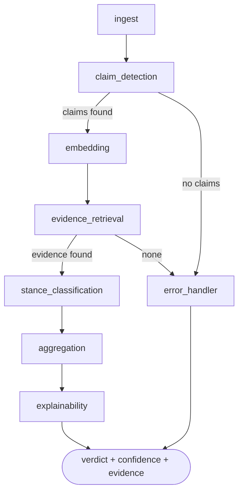

# Fake News Detection — Multi-Agent Claim Verification

A LangGraph pipeline that takes a piece of text, extracts the checkable claims from it, gathers evidence for each one, classifies the stance of that evidence, and produces a verdict with an explanation of how it got there.

The interesting part is not the classification. It is the graph: conditional routing, an explicit error path, and evidence provenance carried through to the output, so a verdict can be traced back to what supported it.

**Status:** working system, self-built. Not evaluated against a labelled benchmark — see [Limits](#limits).

---

## The graph



Eight nodes, three conditional edge groups, one error terminal. Defined in `src/orchestration/workflow.py`; node implementations in `src/orchestration/nodes.py`.

**Why a graph and not a script.** Claim verification fails in a lot of ordinary ways: no checkable claim in the input, no evidence retrieved, a fact-check source timing out. In a linear script each of those becomes a nested conditional and the failure modes get tangled with the happy path. As a state graph, the failure routes are edges — visible, individually testable, and the error handler produces a structured result rather than an exception.

---

## Agents

| Agent | Role |
|---|---|
| `ingest_agent` | Extracts and normalises text from the input |
| `claim_detection_agent` | Identifies checkable factual statements |
| `claim_embedding_agent` | Encodes claims semantically for evidence matching |
| `evidence_retrieval_agent` | Gathers supporting and contradicting evidence from web sources |
| `google_fact_check_agent` | Queries the Google Fact Check Tools API |
| `snopes_agent` | Scrapes Snopes search results for existing fact-checks (Snopes has no public API — this is scraping, with timeout handling) |
| `llm_stance_agent` | Zero-shot stance classification: SUPPORTS / REFUTES / NEUTRAL, via Groq |
| `verdict_agent` | Per-claim and article-level verdicts, called from the aggregation node |
| `aggregation_agent` | Combines per-claim verdicts and evidence into an article verdict |
| `explainability_agent` | Produces a human-readable account of how the verdict was reached |

---

## Stack

| Layer | Technology |
|---|---|
| Orchestration | LangGraph state graph |
| LLM | Groq API (`src/llm/groq_client.py`, prompts in `src/llm/prompts.py`) |
| Embeddings | sentence-transformers |
| API | FastAPI (`src/api/server.py`), Pydantic schemas (`src/api/schemas.py`) |
| Web UI | Flask + Jinja templates (`app.py`, `templates/`) |
| NLP preprocessing | NLTK |
| Logging | loguru |
| External sources | Google Fact Check Tools API, Snopes (scraped) |

---

## Repository layout

```
app.py                    Flask web UI entry point
config.py                 top-level settings
wsgi.py                   WSGI entry point for production
nltk_download.py          one-off NLTK corpus download
src/
  agents/                 the ten agents listed above
  orchestration/          workflow.py (graph), nodes.py, state_graph.py
  llm/                    Groq client and prompt templates
  api/                    FastAPI server and Pydantic schemas
  config.py, utils.py
templates/                Jinja templates: home, index, sidebar
scripts/                  deploy.sh, start-production.sh, verify_setup.py
```

---

## Run it

```bash
git clone https://github.com/sarahbouden/fake-news-detection.git
cd fake-news-detection
python -m venv venv && source venv/bin/activate
pip install -r requirements.txt
python nltk_download.py
```

Set the required keys in your environment (`GROQ_API_KEY`, Google Fact Check API key), then:

```bash
python scripts/verify_setup.py    # checks config and connectivity
python app.py                     # Flask UI
# or
uvicorn src.api.server:app --reload    # FastAPI
```

Deployment scripts for a production run are in `scripts/`; `requirements-deployment.txt` pins the deployment set.

---

## Limits

No labelled evaluation. There is no benchmark run, no precision/recall figure, and no confusion matrix for the verdicts — the system produces confidence scores, but those scores have not been calibrated against ground truth. Treating them as accuracy would be wrong, and I'd want a labelled set before publishing any number.

The Snopes agent scrapes rather than using an API, which means it breaks when the page structure changes. Evidence retrieval quality is bounded by what web search returns. Stance classification is zero-shot, not fine-tuned. Checks against `test_config.py`, `test_real_api.py` and `src/orch_test.py` are ad-hoc scripts, not a pytest suite.
